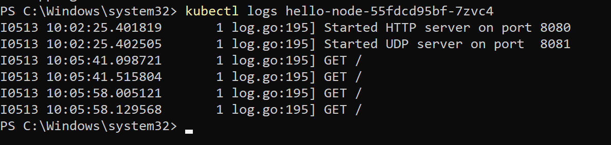
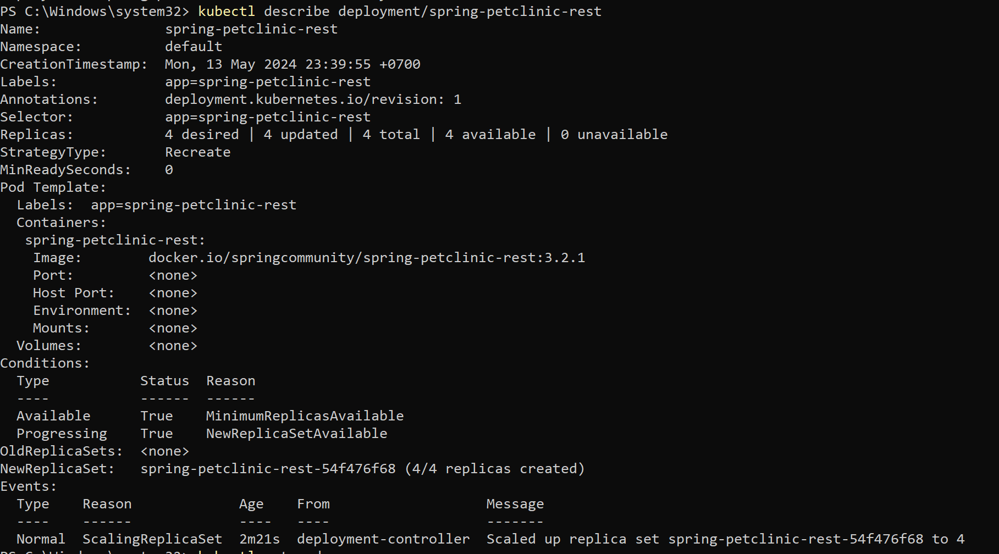
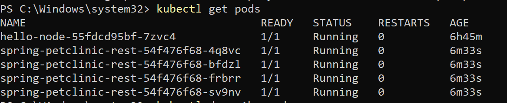

# 📝 Tutorial & Exercise 11 📝

**Student Details:**

| Attribute | Information                |
|-----------|----------------------------|
| Name      | Andika Pramudya Wardana   |
| Student ID| 2206046645                 |
| Class     | Advanced Programming KKI   |

---

<details>
<summary>Module 11: Deployment on Kubernetes</summary>

## Questions and Answers

### -> Reflection on Hello Minikube

#### 1. Compare the application logs before and after you exposed it as a Service. Try to open the app several times while the proxy into the Service is running. What do you see in the logs? Does the number of logs increase each time you open the app?
Answer: In the application logs before exposing it as a Service, we see entries indicating the startup of the HTTP and UDP servers, as well as some HTTP GET requests being made to the server. After exposing the application as a Service and opening the app multiple times while the proxy into the Service is running, we observe additional HTTP GET requests in the logs. Yes, the number of logs increases each time the app is opened, reflecting the increased traffic to the application due to it being exposed as a Service.


#### 2. Notice that there are two versions of `kubectl get` invocation during this tutorial section. The first does not have any option, while the latter has `-n` option with value set to `kube-system`. What is the purpose of the `-n` option and why did the output not list the pods/services that you explicitly created?
 Answer: The -n option in kubectl get is used to specify the namespace in which to list the resources. When not provided, kubectl get lists resources from the default namespace. In the given scenario, the first invocation of kubectl get did not specify a namespace, so it listed resources from the default namespace. The second invocation included the -n kube-system option, which instructed kubectl to list resources from the kube-system namespace. The output did not list the pods/services explicitly created because they were likely created in the default namespace, not in kube-system.

### -> Reflection on Rolling Update & Kubernetes Manifest File

#### 1. What is the difference between Rolling Update and Recreate deployment strategy?

- Rolling Update: In a Rolling Update strategy, Kubernetes updates pods gradually by replacing old pods with new ones, ensuring that the application remains available throughout the update process. It involves incrementally updating the pods in a controlled manner, typically one at a time or in small batches, to minimize downtime and maintain the desired level of application availability. This approach allows for smooth transitions between different versions of the application.

- Recreate: In contrast, the Recreate strategy involves terminating all existing pods and creating entirely new ones with the updated configuration. This approach typically results in downtime during the deployment process because the application becomes temporarily unavailable while the old pods are terminated and new ones are created. However, Recreate deployments may be simpler to implement and manage in certain scenarios, especially for stateless applications where downtime is acceptable.

#### 2. Try deploying the Spring Petclinic REST using Recreate deployment strategy and document your attempt.

1. First, I modify the `deployment.yaml ` file so the deployment type will be `Recreate`. Following this adjustment, I proceed with the deployment process. 


2. Next,  I simulate an update by adjusting the image and then confirm the status of the update. 

3. From the observations made here, it becomes evident that the recreate deployment type operates by terminating all current pods prior to generating new ones, as indicated by the absence of any entries in the OldReplicaSets value.

#### 3. Prepare different manifest files for executing Recreate deployment strategy.

Here is the line of code for my Recreate deployment strategy file:
```yaml
apiVersion: apps/v1
kind: Deployment
metadata:
  annotations:
    deployment.kubernetes.io/revision: "4"
  creationTimestamp: "2024-05-12T04:00:17Z"
  generation: 5
  labels:
    app: spring-petclinic-rest
  name: spring-petclinic-rest
  namespace: default
  resourceVersion: "5477"
  uid: 81a41b68-bbc4-4426-9fd1-5159137cb60e
spec:
  progressDeadlineSeconds: 600
  replicas: 4
  revisionHistoryLimit: 10
  selector:
    matchLabels:
      app: spring-petclinic-rest
  strategy:
    type: Recreate
  template:
    metadata:
      creationTimestamp: null
      labels:
        app: spring-petclinic-rest
    spec:
      containers:
      - image: docker.io/springcommunity/spring-petclinic-rest:3.2.1
        imagePullPolicy: IfNotPresent
        name: spring-petclinic-rest
        resources: {}
        terminationMessagePath: /dev/termination-log
        terminationMessagePolicy: File
      dnsPolicy: ClusterFirst
      restartPolicy: Always
      schedulerName: default-scheduler
      securityContext: {}
      terminationGracePeriodSeconds: 30
status:
  availableReplicas: 4
  conditions:
  - lastTransitionTime: "2024-05-12T04:08:15Z"
    lastUpdateTime: "2024-05-12T04:08:15Z"
    message: Deployment has minimum availability.
    reason: MinimumReplicasAvailable
    status: "True"
    type: Available
  - lastTransitionTime: "2024-05-12T04:00:17Z"
    lastUpdateTime: "2024-05-12T04:13:52Z"
    message: ReplicaSet "spring-petclinic-rest-54f476f68" has successfully progressed.
    reason: NewReplicaSetAvailable
    status: "True"
    type: Progressing
  observedGeneration: 5
  readyReplicas: 4
  replicas: 4
  updatedReplicas: 4
```

#### 4. What do you think are the benefits of using Kubernetes manifest files? Recall your experience in deploying the app manually and compare it to your experience when deploying the same app by applying the manifest files (i.e., invoking `kubectl apply -f` command) to the cluster

With Kubernetes manifest files, we can set up our application just the way we want. This helps us control how the app's infrastructure is set up, making it simpler to manage.
